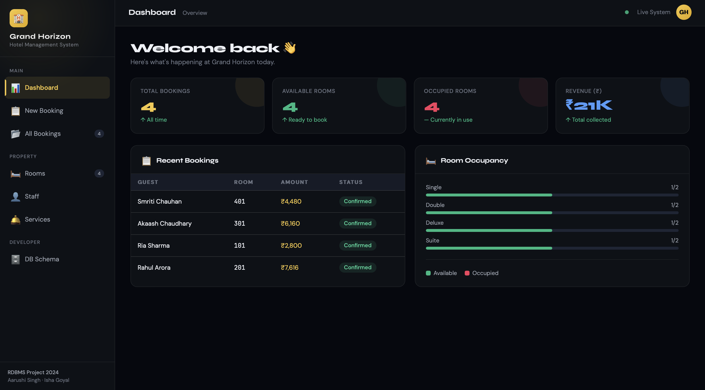
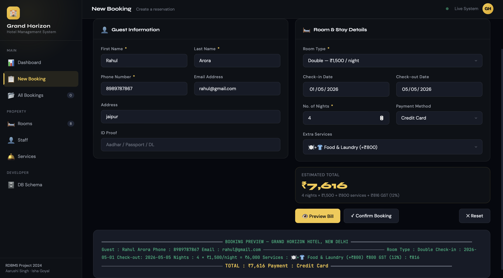
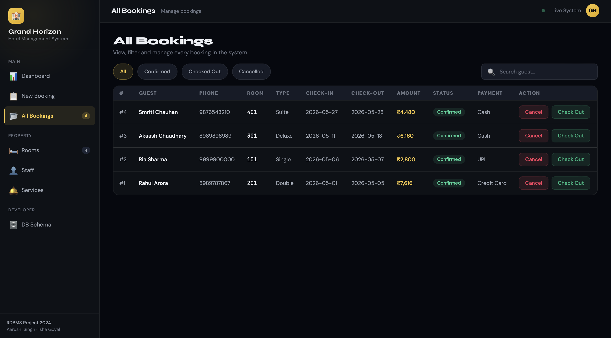
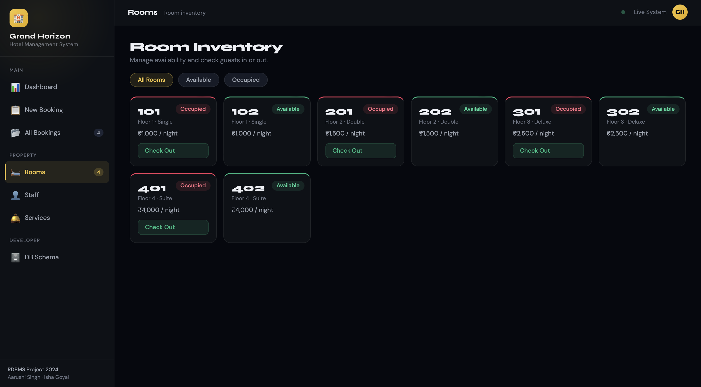
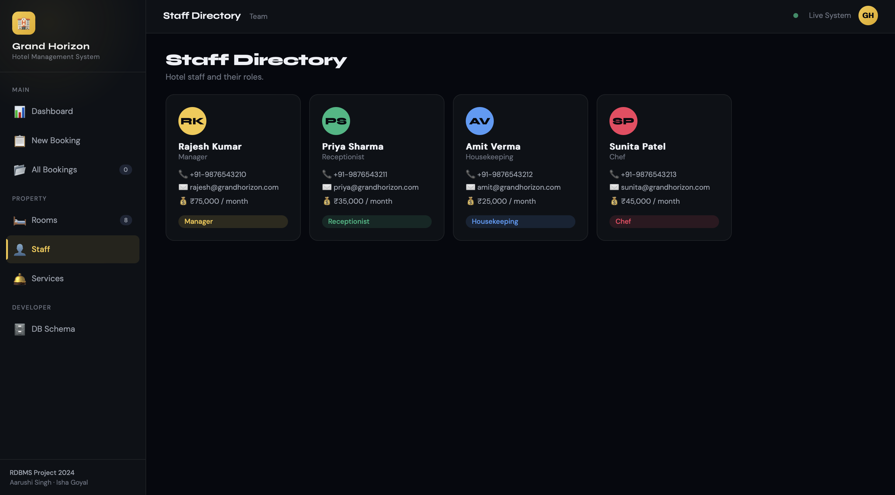
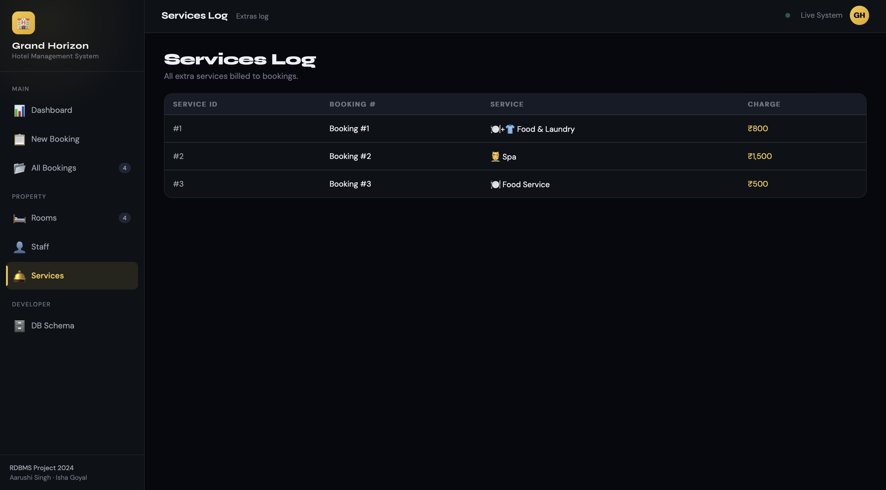
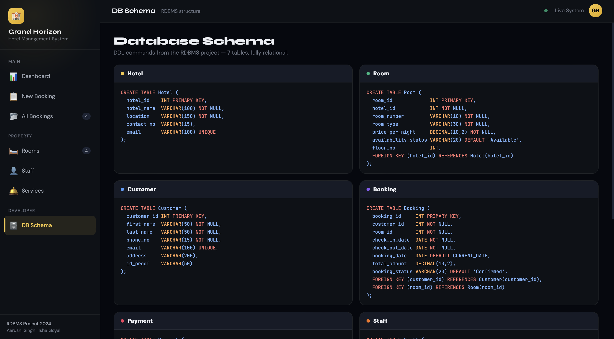
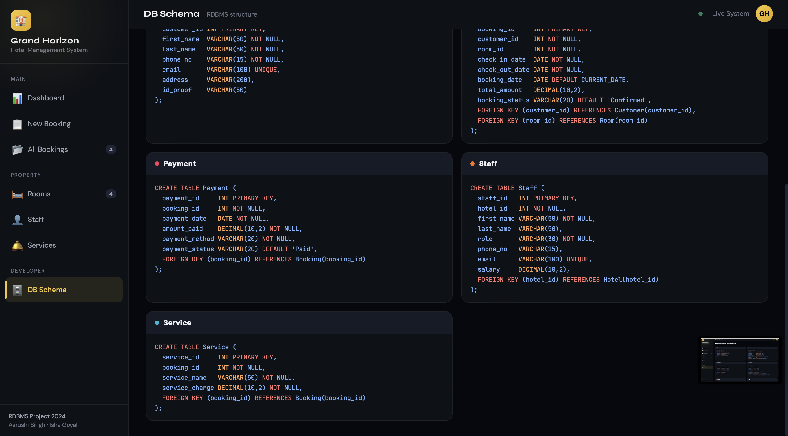

# Grand Horizon Hotel Management System

A modern hotel management system built using HTML, CSS, JavaScript, and SQL schema design.

## Features
- Room booking system
- Dynamic dashboard
- Room availability tracking
- Staff directory
- Service billing
- Booking management
- SQL schema integration

## Tech Stack
- HTML
- CSS
- JavaScript
- SQL

## Future Improvements
- Flask backend
- MySQL integration
- Authentication system
- Invoice generation
- Deployment

## Project Status
Version 1 — Frontend simulation with in-memory database.

## Screenshots

### Dashboard

### New Booking Form & Preview

### All Bookings

### Room Inventory

### Staff Directory

### Services Log

### Database Schema

